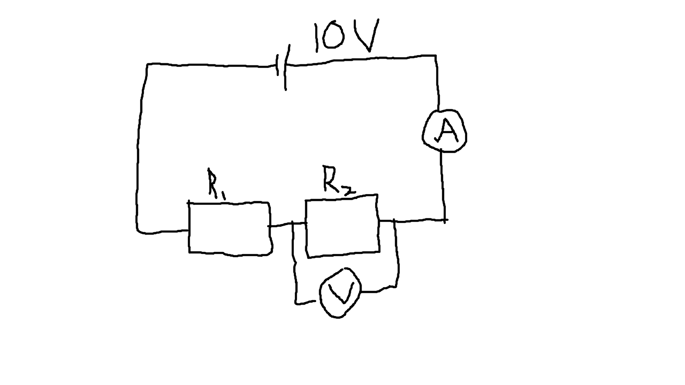
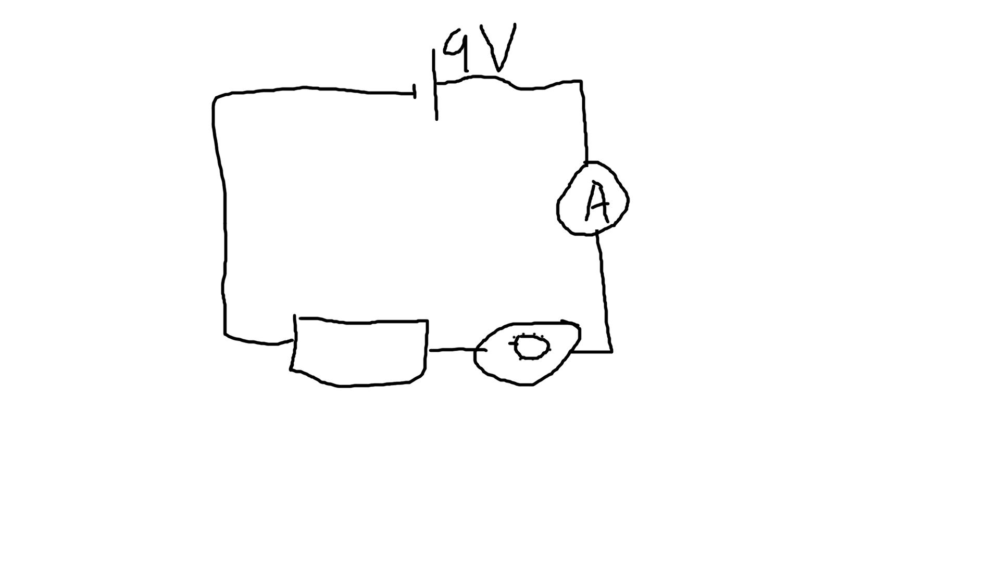

# Fysik Noter

## El-lære - Elektriske kredsløb

```
e = 1,6*10^-19 C
C = Coulomb
I = q/t[C/s][A]
I = (-n*e)/t

P = I * U

I = q / t

U = E / q

P = q/t * E/q = E / t [J/s][W]
```

#### På et sekundt

`I = (-10*1,6*10^-19 C)/1s`

#### Ledere

Jo flere elektroner i yderste skal, jo bedre ledeevne, pga. frie elektroner, fx guld og andre metaller.

Jo tættere elektronerne er i kernen, jo tættere er de bundet, desto værre ledeevne.

#### Isolatore

Stærkt bundne elektroner.

### Systime Orbit HTX B

#### Opgave 4.2.1

```
I = 18A
t = 6ms = 0,006s
q = ladning?

I = q / t [C/s]

18A = q / 0,006s

q = 18A * 0,006s

q = 0,108C
```

#### Opgave 4.2.2

```
I = 0,3A
t = 10m = 600s
q = ladning?
n = antal elektroner?
e = 1,6 * 10^-19

I = q / t

q = I * t

q = 0,3A * 600s

q = 180

n = q / e

n = 180 / (1,6 * 10^-19 C)

n = 1,125 × 10^21
```

#### Opgave 4.5.1

En elektron løber fra en minuspol til en pluspol inde i et røntgenapparat. Derved får den en kinetisk energi på `8,0 fJ`.

Præfikset `f` kaldes femto og står for `10^−15`, så `8,0 fJ` er `8,0 * (10^-15)J`.

Hvilken spændingsforskel er der mellem polerne i røntgenapparatet?

```
E = 8 * 10^-15
q = 1,6 * 10^-19

U = E / q

U = (8 * 10^-15) / (1,6 * 10^-19)

U = 50kV
```

#### Opgave 4.5.2

Strømstyrken i et strygejern er `4,6 A`, når det tilsluttes `230 V`.

Strygejernet benyttes i `10` minutter.

Beregn størrelsen af den ladning, der er strømmet gennem strygejernet i løbet af de `10` minutter.

```
I = 4,6A
U = 230V
t = 10m = 600s
q = ?

I = q / t

q = I * t

q = 4,6 * 600s

q = 2760C
```

Hvor meget energi er der afsat?

```
U = E / q

E = U * q

E = 230V * 2760C

E = 634800J
```

Hvor stor er den omsatte effekt?

```
P = E / t

P = 634800J / 600s

P = 1058W
```

### Komponenter

Komponent | Symbol
---|---
Strømkilde | `--||--`
Leder | `----`
Pære | `(><)`
Afbryder | `-- \--`
Ampermeter | `--(A)--`
Voltmeter | `--(V)--`
Ohmmeter | `--(Ω)--`
Modstand | `--[__]--`

```
I     (e-)->  
v  +  -
 ---||---
|        |
(A)     /
|        |
---------
```

### Spænding

```
U [V] = E / q [J/C]
```

#### Voltmeter

Sidder parallelt med det målte subkredsløb.

```
  +  -
+--||--+
|      |
+--(v)-+
|      |
+-(><)-+
```

### Effektloven

```
P = I * U

I = q / t

U = E / q

q / t * E / q = E / t [J/s][W]

P [W] = I [v] * U [A]
```

### 'El-lære opgaver.docx' 1-2-2022

Vi sender en elektrisk strøm med strømstyrken 10A gennem ledningen.

d. Bestem antallet af elektroner, der passerer et givet tværsnit i løbet af l s.

#### d.

```
I = 10A
t = 1s
q = ladningen?
n = antal elektroner?
e = 1,6 * 10^-19

I = q / t

q = I * t

q = 10A * 1s

q = 10C

n = q / e

n = 10C / 1,6 * 10^-19

6,25×10^19
```

#### 1.05

En bestemt sikring springer, hvis der går en strømstyrke større end 16A gennem den.

Hvor mange elektroner svarer det til på et minut?

```
I = 16 A
t = 1m = 60s
q = ladning?
n = antal elektroner?
e = 1,6 * 10^-19

I = q / t

q = I * t

q = 16A * 60s

q = 960C

n = q / e

n = 960C / 1,6 * 10^-19

n = 6×10^21
```

#### 1.07

Et 9V batteri er tilsluttet en pære i en lommelygte.

a. Hvor stor en ladning skal gå gennem pæren, for at der er afsat 150J

```
E = 150J
U = 9V
q = ladning?

P = q / t * E / q

P = q / t * 150J / q

q / t * 150J / q = q / t * 9V

q * 150J / q = q * 9V

150J / q = 9V

150J = 9V * q

150J / 9V = q

q = 150J / 9V

q = 16,67C
```

b. De 150J afsættes i pæren på 5 minutter. Beregn strømstyrken.

```
E = 150J
t = 5m = 300s
U = 9V

P = I * U

I = P / U

P = E / t

P = 150J / 300s

P = 0.5W

I = 0.5W / 9V

I = 0,0556A
```

#### 1.08

På et minut løber 600C gennen en ledning til et elektrisk apparat, hvor spændingsfaldet er 230V.

a. Hvor meget energi afsættes i det elektriske apparat?

```
q = 600C
t = 1m = 60s
U = 230V
E = energien?

U = E/q

q = E/U

E * q = U

E = U / q

E = 230V / 600C

E = 0,3833J
```

b. Hvilken effekt svarer det til?

```
q = 600C
t = 60s
U = 230V
E = 0,3833J
P = effekt?

P = I * U

I = q / t

I = 600C / 60s

I = 10A

P = 10A * 230V

P = 2300W
```

### Resistans / modstand

#### Ohms lov

```
U [V] = R [Ω] * I [A]
```

#### Joules lov

```
R [Ω] = (U [V])^2 / P [W]

P [J] = R [Ω] * (I [A])^2
```

Joules lov er en kombination af Ohms lov og effektloven

#### Ohmmeter

```
 +-----+    +-(Ω)--+
 +-(V)-+    |      |
 |     | == |      |
 (A)   |    |      |
 +(><)-+    +-(><)-+
```

#### Regneregler

```
1/1/U = U

U * (1/1/U) = U^2
```

#### Tavleeksempel

```
P = 6W
U = 230V
R = ?

effekt loven´
P = U * I

I = P / U

ohms lov
R = U / I

R = U / (P / U)

joules lov
R = U^2 / P

U * I / I / U = UU = U^2

R = (230V)^2 / 6W

R = 8817Ω

joules lov
```

#### Opgave 4.6.1

Strømstyrken  i en hårtørre er 5,4A, når den tilsluttes 230V.

Beregn hårtørrens effekt.

```
I = 5,4A
U = 230V
P = ?

P = U * I

P = 230V * 5,4A

P = 1242W
```

Hårtørren benyttes i 5 minutter. Hvor meget energi omsætter den?

```
I = 5,4A
U = 230V
t = 5m = 300s
E = ?

P = U * I

P = E / t

E = P * t

E = U * I * t

E = 5,4A * 230V * 300s

E = 372600J
```

#### Opgave 4.7.1

Pæren i en lommelygte lyder med effekten 4,2W, når der går en strøm på 0,50A gennem den.

a. Hvad er da spændingsforskellen over pæren?

```
P = 4,2W
I = 0,50A
U = ?

P = U * I

U = P / I

U = 4,2W / 0,50A

U = 8,4 V
```

b. Hvad er pærens resistans?

```
P = 4,2W
I = 0,50A
R = ?

U = R * I

R = U / I

U = P / I

R = (P / I) / I

R = (4,2W / 0,50A) / 0,50A

R = 16,8Ω
```

### Resistivitet

```
ρ [Ω * m]

R = ρ * (L [m] / A [m^2])

ρ = R[Ω] * (A [m^2]/ L [m])
```

Modstand afhænger af længden.

En ledning har en længde [m] og en tykkelse (tværsnitsareal) [m^2].

#### Opgave 4.9.1

Beregn resistansen ved OºC i en 3,0m lang wolframtråd, som har en diameter på 6,0 * 10^-4m.

```
ρ = 0,0489 * 10^-6 Ω*m
L = 3,0m
Ø = 6,0 * 10^-4m
R = ?

R = rho * (L / A)

A = pi * (Ø / 2)

R = rho * (L / (pi * (Ø / 2)^2))

R = (0,0489 * 10^-6Ω*m) * (3,0m / (pi * ((6,0 * 10^-4m) / 2)^2))

R = 0,518845114Ω ??? 
```

#### Opgave 4.9.2

Beregn resistansen ved 0ºC i en 2,5 m lang jerntråd med diameteren 0,50 mm.

```
rho = 0,089 * 10^-6
L = 2,5m
Ø = 0,5mm = 0,0005m
R = ?

R = rho * (L / A)

A = pi * (Ø / 2)

R = rho * (L / (pi * (Ø / 2)^2))

R = (0,089 * 10^-6) * (2,5m / (pi * (0,0005m / 2)^2))

R = 1,133183195Ω ???
```

### Serieforbindelser


```
R = R_1 + R_2 + ...R_n

I = I_1 = I_2 = ...I_n

U = U_1 + U_2 + ...U_n
```

#### Opgave 4.11.1



Bestem strømmen gennem kredsløbet, når `R_1 = 2Ω` og `R_2 = 3Ω`

```
U = 10V

R_res = ...+ R_n

R_res = R_1 + R_2 = 2Ω + 3Ω

R_res = 5Ω

U = R * I

I = U / R

I = 10V / 5Ω

I = 2A
```

Bestem spændingsforskellen over `R_2`

```
R = 3Ω
I = 2A

U = R * I

U = 3Ω * 2A

U = 6V
```

#### Opgave 4.11.2



To resistorer forbindes i serie.

Den ene er en normal resistor.

Den anden er en variabel resistor, som kan ændre resistans mellem nul og en maksimal værdi, når man drejer på en knap.

De forbindes til et 9 V batteri, og man skal kunne regulere strømstyrken mellem 15 mA og 60 mA, når man drejer på knappen.

Hvilken værdi skal den faste resistor have?

```
U = 9V
I = 15mA = 0,015A

U = R * I

R = U / I

R = 9V  / 0,015A

R = 600Ω
```

Hvad skal den variable resistors maksimale værdi være?

```
U = 9V
I = 60mA = 0,006A
R_fast = 600Ω

R_total = R_fast + R_var

R_total = U / I

R_var = R_total - R_fast

R_var = U / I - R_fast

R_var = 9V / 0,006A - 600Ω

R_var = 900Ω
```


